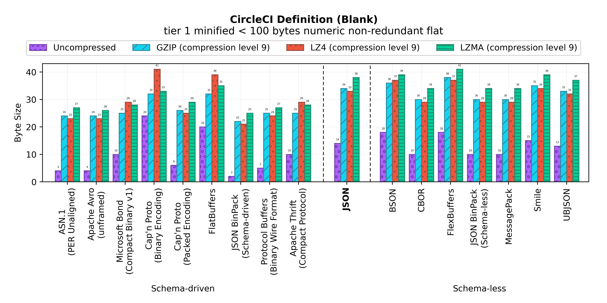
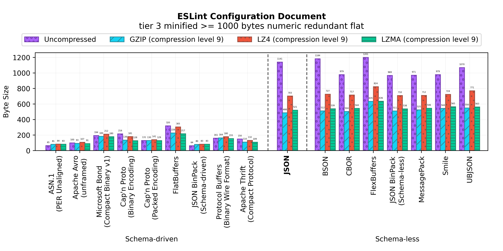
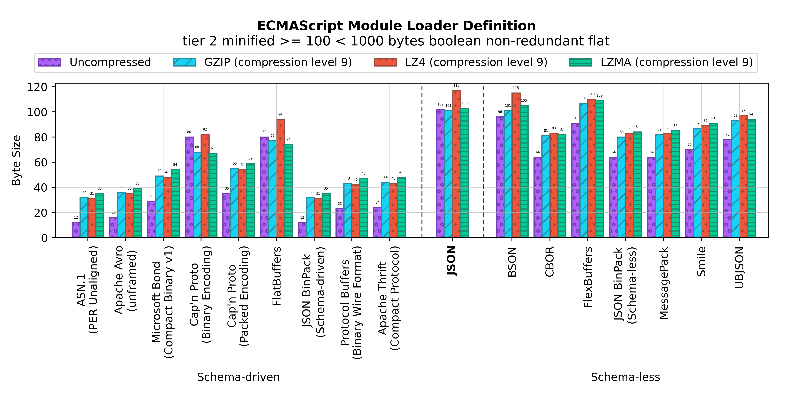
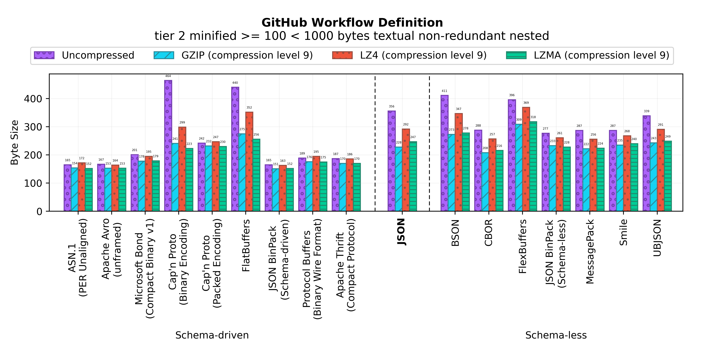
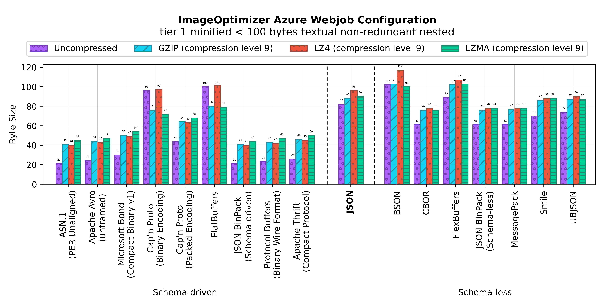
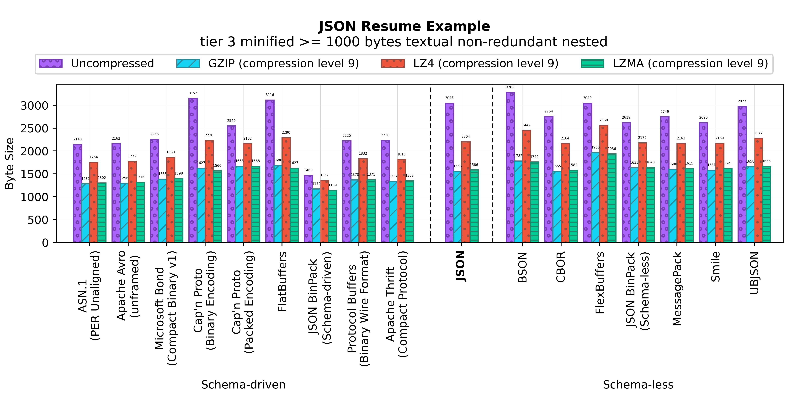
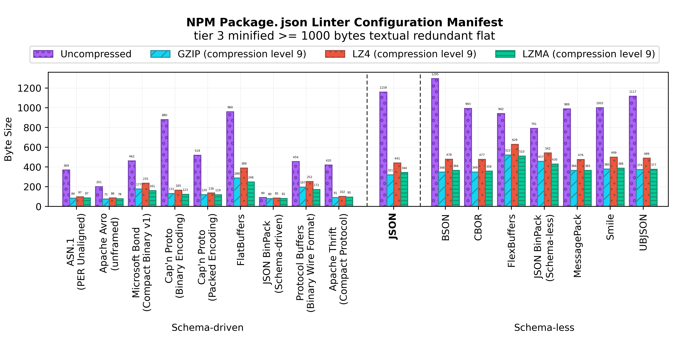
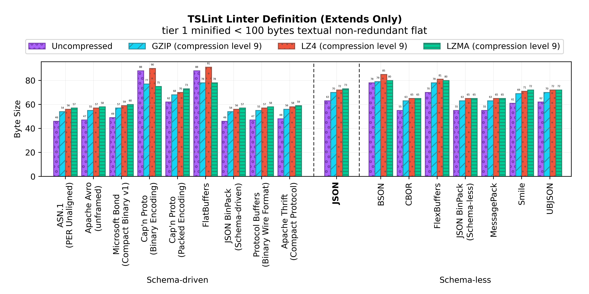

Binary JSON-compatible Format Size Benchmark
============================================

[**JSON documents**](#json-documents) | [**Serialization formats**](#serialization-formats) | [**Results**](#results) | [**Running locally**](#running-locally)

A large-scale space-efficiency benchmark of JSON-compatible binary
serialization formats involving representative real-world JSON documents.


JSON documents
--------------

This size benchmark utilizes representative real-world JSON documents adapted
from the open-source Apache-2.0
[SchemaStore](https://www.schemastore.org/json/)'s [test
suite](https://github.com/SchemaStore/schemastore/tree/master/src/test). All
the JSON documents used in this benchmark are described in the table below.
The *type* column is based on JSON BinPack's [JSON Stats online
tool](https://www.jsonbinpack.org/stats/).

| Name | Type | Link | SchemaStore |
|------|------|------|-------------|
| [CircleCI definition (blank)](#circleciblank) | tiny numeric non-redundant flat  | [:arrow_upper_right:](benchmark/circleciblank/document.json) | [:arrow_upper_right:](https://github.com/SchemaStore/schemastore/blob/0b6bd2a08005e6f7a65a68acaf3064d6e2670872/src/test/circleciconfig/version-2.0.json) |
| [CircleCI matrix definition](#circlecimatrix) | tiny numeric non-redundant nested  | [:arrow_upper_right:](benchmark/circlecimatrix/document.json) | [:arrow_upper_right:](https://github.com/SchemaStore/schemastore/blob/0b6bd2a08005e6f7a65a68acaf3064d6e2670872/src/test/circleciconfig/matrix-simple.json) |
| [CommitLint configuration](#commitlint) | tiny textual redundant nested  | [:arrow_upper_right:](benchmark/commitlint/document.json) | [:arrow_upper_right:](https://github.com/SchemaStore/schemastore/blob/0b6bd2a08005e6f7a65a68acaf3064d6e2670872/src/test/commitlintrc/commitlintrc-test5.json) |
| [CommitLint configuration (basic)](#commitlintbasic) | tiny boolean non-redundant flat  | [:arrow_upper_right:](benchmark/commitlintbasic/document.json) | [:arrow_upper_right:](https://github.com/SchemaStore/schemastore/blob/0b6bd2a08005e6f7a65a68acaf3064d6e2670872/src/test/commitlintrc/commitlintrc-test3.json) |
| [Entry Point Regulation manifest](#epr) | small textual redundant nested  | [:arrow_upper_right:](benchmark/epr/document.json) | [:arrow_upper_right:](https://github.com/SchemaStore/schemastore/blob/0b6bd2a08005e6f7a65a68acaf3064d6e2670872/src/test/epr-manifest/official-example.json) |
| [ESLint configuration document](#eslintrc) | large numeric redundant flat  | [:arrow_upper_right:](benchmark/eslintrc/document.json) | [:arrow_upper_right:](https://github.com/SchemaStore/schemastore/blob/0b6bd2a08005e6f7a65a68acaf3064d6e2670872/src/test/eslintrc/WebAnalyzer.json) |
| [ ECMAScript module loader definition](#esmrc) | small boolean non-redundant flat  | [:arrow_upper_right:](benchmark/esmrc/document.json) | [:arrow_upper_right:](https://github.com/SchemaStore/schemastore/blob/0b6bd2a08005e6f7a65a68acaf3064d6e2670872/src/test/esmrc/.esmrc_.json) |
| [GeoJSON example JSON document](#geojson) | small numeric redundant nested  | [:arrow_upper_right:](benchmark/geojson/document.json) | [:arrow_upper_right:](https://github.com/SchemaStore/schemastore/blob/0b6bd2a08005e6f7a65a68acaf3064d6e2670872/src/test/geojson/multi-polygon.json) |
| [GitHub FUNDING sponsorship definition (empty)](#githubfundingblank) | small boolean redundant flat  | [:arrow_upper_right:](benchmark/githubfundingblank/document.json) | [:arrow_upper_right:](https://github.com/SchemaStore/schemastore/blob/0b6bd2a08005e6f7a65a68acaf3064d6e2670872/src/test/github-funding/ebookfoundation.json) |
| [GitHub Workflow Definition](#githubworkflow) | small textual non-redundant nested  | [:arrow_upper_right:](benchmark/githubworkflow/document.json) | [:arrow_upper_right:](https://github.com/SchemaStore/schemastore/blob/0b6bd2a08005e6f7a65a68acaf3064d6e2670872/src/test/github-workflow/919.json) |
| [Grunt.js "clean" task definition](#gruntcontribclean) | tiny textual redundant flat  | [:arrow_upper_right:](benchmark/gruntcontribclean/document.json) | [:arrow_upper_right:](https://github.com/SchemaStore/schemastore/blob/0b6bd2a08005e6f7a65a68acaf3064d6e2670872/src/test/grunt-clean-task/with-options.json) |
| [ImageOptimizer Azure Webjob configuration](#imageoptimizerwebjob) | tiny textual non-redundant nested  | [:arrow_upper_right:](benchmark/imageoptimizerwebjob/document.json) | [:arrow_upper_right:](https://github.com/SchemaStore/schemastore/blob/0b6bd2a08005e6f7a65a68acaf3064d6e2670872/src/test/imageoptimizer/default.json) |
| [JSON-e templating engine reverse sort example](#jsonereversesort) | tiny numeric redundant nested  | [:arrow_upper_right:](benchmark/jsonereversesort/document.json) | [:arrow_upper_right:](https://github.com/SchemaStore/schemastore/blob/0b6bd2a08005e6f7a65a68acaf3064d6e2670872/src/test/jsone/reverse-sort.json) |
| [JSON-e templating engine sort example](#jsonesort) | tiny numeric redundant flat  | [:arrow_upper_right:](benchmark/jsonesort/document.json) | [:arrow_upper_right:](https://github.com/SchemaStore/schemastore/blob/0b6bd2a08005e6f7a65a68acaf3064d6e2670872/src/test/jsone/sort.json) |
| [JSON Feed example document](#jsonfeed) | small textual non-redundant flat  | [:arrow_upper_right:](benchmark/jsonfeed/document.json) | [:arrow_upper_right:](https://github.com/SchemaStore/schemastore/blob/0b6bd2a08005e6f7a65a68acaf3064d6e2670872/src/test/feed/microblog.json) |
| [JSON Resume](#jsonresume) | large textual non-redundant nested  | [:arrow_upper_right:](benchmark/jsonresume/document.json) | [:arrow_upper_right:](https://github.com/SchemaStore/schemastore/blob/0b6bd2a08005e6f7a65a68acaf3064d6e2670872/src/test/resume/richardhendriks.json) |
| [.NET Core project.json](#netcoreproject) | large textual redundant nested  | [:arrow_upper_right:](benchmark/netcoreproject/document.json) | [:arrow_upper_right:](https://github.com/SchemaStore/schemastore/blob/0b6bd2a08005e6f7a65a68acaf3064d6e2670872/src/test/project/EF-project.json) |
| [Nightwatch.js Test Framework Configuration](#nightwatch) | large boolean redundant flat  | [:arrow_upper_right:](benchmark/nightwatch/document.json) | [:arrow_upper_right:](https://github.com/SchemaStore/schemastore/blob/0b6bd2a08005e6f7a65a68acaf3064d6e2670872/src/test/nightwatch/default.json) |
| [OpenWeatherMap API example JSON document](#openweathermap) | small numeric non-redundant flat  | [:arrow_upper_right:](benchmark/openweathermap/document.json) | [:arrow_upper_right:](https://github.com/SchemaStore/schemastore/blob/0b6bd2a08005e6f7a65a68acaf3064d6e2670872/src/test/openweather.current/example.json) |
| [OpenWeather Road Risk API example](#openweatherroadrisk) | small numeric non-redundant nested  | [:arrow_upper_right:](benchmark/openweatherroadrisk/document.json) | [:arrow_upper_right:](https://github.com/SchemaStore/schemastore/blob/0b6bd2a08005e6f7a65a68acaf3064d6e2670872/src/test/openweather.roadrisk/example.json) |
| [NPM Package.json example manifest](#packagejson) | large textual non-redundant flat  | [:arrow_upper_right:](benchmark/packagejson/document.json) | [:arrow_upper_right:](https://github.com/SchemaStore/schemastore/blob/0b6bd2a08005e6f7a65a68acaf3064d6e2670872/src/test/package/package-test.json) |
| [NPM Package.json Linter configuration manifest](#packagejsonlintrc) | large textual redundant flat  | [:arrow_upper_right:](benchmark/packagejsonlintrc/document.json) | [:arrow_upper_right:](https://github.com/SchemaStore/schemastore/blob/0b6bd2a08005e6f7a65a68acaf3064d6e2670872/src/test/npmpackagejsonlintrc/npmpackagejsonlintrc-test.json) |
| [SAP Cloud SDK Continuous Delivery Toolkit configuration](#sapcloudsdkpipeline) | tiny boolean redundant flat  | [:arrow_upper_right:](benchmark/sapcloudsdkpipeline/document.json) | [:arrow_upper_right:](https://github.com/SchemaStore/schemastore/blob/0b6bd2a08005e6f7a65a68acaf3064d6e2670872/src/test/cloud-sdk-pipeline-config-schema/empty.json) |
| [TravisCI notifications configuration](#travisnotifications) | small textual redundant flat  | [:arrow_upper_right:](benchmark/travisnotifications/document.json) | [:arrow_upper_right:](https://github.com/SchemaStore/schemastore/blob/0b6bd2a08005e6f7a65a68acaf3064d6e2670872/src/test/travis/notification-secure.json) |
| [TSLint linter definition (basic)](#tslintbasic) | tiny boolean non-redundant nested  | [:arrow_upper_right:](benchmark/tslintbasic/document.json) | [:arrow_upper_right:](https://github.com/SchemaStore/schemastore/blob/0b6bd2a08005e6f7a65a68acaf3064d6e2670872/src/test/tslint/tslint-test19.json) |
| [TSLint linter definition (extends only)](#tslintextend) | tiny textual non-redundant flat  | [:arrow_upper_right:](benchmark/tslintextend/document.json) | [:arrow_upper_right:](https://github.com/SchemaStore/schemastore/blob/0b6bd2a08005e6f7a65a68acaf3064d6e2670872/src/test/tslint/tslint-test5.json) |
| [TSLint linter definition (multi-rule)](#tslintmulti) | tiny boolean redundant nested  | [:arrow_upper_right:](benchmark/tslintmulti/document.json) | [:arrow_upper_right:](https://github.com/SchemaStore/schemastore/blob/0b6bd2a08005e6f7a65a68acaf3064d6e2670872/src/test/tslint/tslint-test25.json) |

Serialization formats
---------------------

This benchmark involves the serialization formats, implementations, and
encodings described in the table below.

| Serialization Format | Implementation           | Version | Encodings                       |
|----------------------|--------------------------|---------|---------------------------------|
| ASN.1                | ASN-1Step                | 10.0.2  | PER Unaligned                   |
| Apache Avro          | Python `avro` (pip)      | 1.10.0  | Binary Encoding with no framing |
| Microsoft Bond       | C++                      | 9.0.4   | Compact Binary v1               |
| BSON                 | Node.js `bson` (npm)     | 4.2.2   |                                 |
| Cap'n Proto          | `capnp`                  | 0.8.0   | Packed and Binary               |
| CBOR                 | Python `cbor2` (pip)     | 5.1.2   |                                 |
| FlatBuffers          | `flatc`                  | 1.12.0  | Binary Wire Format              |
| FlexBuffers          | `flatc`                  | 1.12.0  | Binary Wire Format              |
| MessagePack          | `msgpack-tools`          | 0.6     |                                 |
| Protocol Buffers     | Python `protobuf` (pip)  | 3.15.3  | Binary Wire Format              |
| Smile                | Clojure `cheshire`       | 5.10.0  |                                 |
| Apache Thrift        | Python `thrift` (pip)    | 0.13.0  | Compact Protocol                |
| UBJSON               | Python `py-ubjson` (pip) | 0.16.1  | Compact Protocol                |

Results
-------

<h3 id="circleciblank">CircleCI definition (blank)</h3>



| Serialization Format | Uncompressed | GZIP (-9) | LZ4 (-9) | LZMA (-9) |
|----------------------|--------------|-----------|----------|-----------|
| ASN.1 (PER Unaligned) | 4 | 24 | 23 | 27 |
| Apache Avro (unframed) | 4 | 24 | 23 | 26 |
| Microsoft Bond (Compact Binary v1) | 10 | 25 | 29 | 28 |
| BSON | 18 | 36 | 37 | 39 |
| Cap'n Proto | 24 | 32 | 41 | 33 |
| Cap'n Proto (packed) | 6 | 26 | 25 | 29 |
| CBOR | 10 | 30 | 29 | 34 |
| FlatBuffers | 20 | 32 | 39 | 35 |
| FlexBuffers | 18 | 38 | 37 | 41 |
| JSON | 14 | 34 | 33 | 38 |
| MessagePack | 10 | 30 | 29 | 34 |
| Protocol Buffers | 5 | 25 | 24 | 27 |
| Smile | 15 | 35 | 34 | 39 |
| Apache Thrift (Compact Protocol) | 10 | 25 | 29 | 28 |
| UBJSON | 13 | 33 | 32 | 37 |

<h3 id="circlecimatrix">CircleCI matrix definition</h3>


| Serialization Format | Uncompressed | GZIP (-9) | LZ4 (-9) | LZMA (-9) |
|----------------------|--------------|-----------|----------|-----------|
| ASN.1 (PER Unaligned) | 18 | 36 | 37 | 38 |
| Apache Avro (unframed) | 15 | 32 | 34 | 36 |
| Microsoft Bond (Compact Binary v1) | 30 | 43 | 49 | 45 |
| BSON | 136 | 123 | 150 | 121 |
| Cap'n Proto | 96 | 56 | 72 | 54 |
| Cap'n Proto (packed) | 36 | 49 | 54 | 50 |
| CBOR | 72 | 89 | 91 | 90 |
| FlatBuffers | 104 | 82 | 104 | 77 |
| FlexBuffers | 157 | 134 | 151 | 131 |
| JSON | 95 | 99 | 112 | 101 |
| MessagePack | 72 | 90 | 91 | 92 |
| Protocol Buffers | 26 | 43 | 45 | 46 |
| Smile | 87 | 104 | 106 | 105 |
| Apache Thrift (Compact Protocol) | 28 | 39 | 47 | 42 |
| UBJSON | 92 | 103 | 111 | 104 |

<h3 id="commitlint">CommitLint configuration</h3>


| Serialization Format | Uncompressed | GZIP (-9) | LZ4 (-9) | LZMA (-9) |
|----------------------|--------------|-----------|----------|-----------|
| ASN.1 (PER Unaligned) | 50 | 48 | 55 | 52 |
| Apache Avro (unframed) | 40 | 41 | 49 | 45 |
| Microsoft Bond (Compact Binary v1) | 63 | 56 | 62 | 60 |
| BSON | 147 | 97 | 112 | 97 |
| Cap'n Proto | 152 | 75 | 96 | 73 |
| Cap'n Proto (packed) | 76 | 67 | 75 | 71 |
| CBOR | 74 | 67 | 76 | 70 |
| FlatBuffers | 156 | 95 | 122 | 91 |
| FlexBuffers | 90 | 97 | 105 | 99 |
| JSON | 96 | 80 | 86 | 83 |
| MessagePack | 74 | 68 | 76 | 71 |
| Protocol Buffers | 62 | 60 | 70 | 63 |
| Smile | 84 | 76 | 82 | 80 |
| Apache Thrift (Compact Protocol) | 59 | 53 | 59 | 57 |
| UBJSON | 93 | 79 | 86 | 83 |

<h3 id="commitlintbasic">CommitLint configuration (basic)</h3>


| Serialization Format | Uncompressed | GZIP (-9) | LZ4 (-9) | LZMA (-9) |
|----------------------|--------------|-----------|----------|-----------|
| ASN.1 (PER Unaligned) | 1 | 21 | 20 | 24 |
| Apache Avro (unframed) | 1 | 21 | 20 | 24 |
| Microsoft Bond (Compact Binary v1) | 3 | 23 | 22 | 26 |
| BSON | 22 | 41 | 41 | 44 |
| Cap'n Proto | 24 | 31 | 41 | 31 |
| Cap'n Proto (packed) | 6 | 26 | 25 | 29 |
| CBOR | 17 | 37 | 36 | 41 |
| FlatBuffers | 20 | 31 | 39 | 34 |
| FlexBuffers | 25 | 45 | 44 | 49 |
| JSON | 25 | 45 | 44 | 49 |
| MessagePack | 17 | 37 | 36 | 41 |
| Protocol Buffers | 0 | 20 | 15 | 23 |
| Smile | 22 | 42 | 41 | 47 |
| Apache Thrift (Compact Protocol) | 2 | 22 | 21 | 25 |
| UBJSON | 19 | 39 | 38 | 43 |

<h3 id="epr">Entry Point Regulation manifest</h3>


| Serialization Format | Uncompressed | GZIP (-9) | LZ4 (-9) | LZMA (-9) |
|----------------------|--------------|-----------|----------|-----------|
| ASN.1 (PER Unaligned) | 231 | 180 | 208 | 175 |
| Apache Avro (unframed) | 195 | 168 | 197 | 167 |
| Microsoft Bond (Compact Binary v1) | 262 | 199 | 225 | 191 |
| BSON | 564 | 304 | 378 | 299 |
| Cap'n Proto | 536 | 261 | 326 | 233 |
| Cap'n Proto (packed) | 318 | 255 | 280 | 241 |
| CBOR | 412 | 248 | 306 | 246 |
| FlatBuffers | 504 | 290 | 369 | 273 |
| FlexBuffers | 429 | 355 | 417 | 342 |
| JSON | 520 | 264 | 332 | 272 |
| MessagePack | 412 | 262 | 307 | 254 |
| Protocol Buffers | 247 | 196 | 222 | 189 |
| Smile | 356 | 266 | 311 | 261 |
| Apache Thrift (Compact Protocol) | 251 | 192 | 220 | 186 |
| UBJSON | 469 | 272 | 326 | 265 |

<h3 id="eslintrc">ESLint configuration document</h3>



| Serialization Format | Uncompressed | GZIP (-9) | LZ4 (-9) | LZMA (-9) |
|----------------------|--------------|-----------|----------|-----------|
| ASN.1 (PER Unaligned) | 65 | 81 | 84 | 83 |
| Apache Avro (unframed) | 100 | 93 | 107 | 91 |
| Microsoft Bond (Compact Binary v1) | 194 | 184 | 212 | 180 |
| BSON | 1184 | 512 | 727 | 539 |
| Cap'n Proto | 216 | 136 | 181 | 128 |
| Cap'n Proto (packed) | 131 | 130 | 141 | 129 |
| CBOR | 979 | 504 | 717 | 544 |
| FlatBuffers | 320 | 228 | 305 | 217 |
| FlexBuffers | 1201 | 635 | 824 | 636 |
| JSON | 1141 | 488 | 703 | 521 |
| MessagePack | 971 | 525 | 712 | 546 |
| Protocol Buffers | 161 | 164 | 180 | 155 |
| Smile | 979 | 544 | 724 | 565 |
| Apache Thrift (Compact Protocol) | 150 | 110 | 132 | 109 |
| UBJSON | 1070 | 550 | 771 | 563 |

<h3 id="esmrc"> ECMAScript module loader definition</h3>



| Serialization Format | Uncompressed | GZIP (-9) | LZ4 (-9) | LZMA (-9) |
|----------------------|--------------|-----------|----------|-----------|
| ASN.1 (PER Unaligned) | 12 | 32 | 31 | 35 |
| Apache Avro (unframed) | 16 | 36 | 35 | 39 |
| Microsoft Bond (Compact Binary v1) | 29 | 49 | 48 | 54 |
| BSON | 96 | 101 | 115 | 105 |
| Cap'n Proto | 80 | 68 | 82 | 67 |
| Cap'n Proto (packed) | 35 | 55 | 54 | 59 |
| CBOR | 64 | 81 | 83 | 82 |
| FlatBuffers | 80 | 77 | 94 | 74 |
| FlexBuffers | 91 | 107 | 110 | 109 |
| JSON | 102 | 101 | 117 | 103 |
| MessagePack | 64 | 82 | 83 | 85 |
| Protocol Buffers | 23 | 43 | 42 | 47 |
| Smile | 70 | 87 | 89 | 91 |
| Apache Thrift (Compact Protocol) | 24 | 44 | 43 | 48 |
| UBJSON | 78 | 93 | 97 | 94 |

<h3 id="geojson">GeoJSON example JSON document</h3>


| Serialization Format | Uncompressed | GZIP (-9) | LZ4 (-9) | LZMA (-9) |
|----------------------|--------------|-----------|----------|-----------|
| ASN.1 (PER Unaligned) | 205 | 105 | 136 | 103 |
| Apache Avro (unframed) | 283 | 100 | 130 | 92 |
| Microsoft Bond (Compact Binary v1) | 298 | 116 | 143 | 106 |
| BSON | 456 | 187 | 234 | 167 |
| Cap'n Proto | 448 | 146 | 197 | 132 |
| Cap'n Proto (packed) | 228 | 142 | 162 | 137 |
| CBOR | 172 | 112 | 138 | 109 |
| FlatBuffers | 680 | 220 | 291 | 195 |
| FlexBuffers | 309 | 167 | 200 | 163 |
| JSON | 190 | 121 | 146 | 116 |
| MessagePack | 162 | 111 | 132 | 109 |
| Protocol Buffers | 325 | 115 | 145 | 107 |
| Smile | 228 | 131 | 158 | 128 |
| Apache Thrift (Compact Protocol) | 277 | 110 | 136 | 104 |
| UBJSON | 208 | 126 | 153 | 120 |

<h3 id="githubfundingblank">GitHub FUNDING sponsorship definition (empty)</h3>


| Serialization Format | Uncompressed | GZIP (-9) | LZ4 (-9) | LZMA (-9) |
|----------------------|--------------|-----------|----------|-----------|
| ASN.1 (PER Unaligned) | 16 | 36 | 35 | 39 |
| Apache Avro (unframed) | 16 | 36 | 35 | 39 |
| Microsoft Bond (Compact Binary v1) | 49 | 64 | 68 | 64 |
| BSON | 133 | 125 | 152 | 137 |
| Cap'n Proto | 40 | 50 | 56 | 51 |
| Cap'n Proto (packed) | 25 | 45 | 44 | 50 |
| CBOR | 124 | 114 | 143 | 131 |
| FlatBuffers | 68 | 71 | 79 | 71 |
| FlexBuffers | 152 | 143 | 168 | 148 |
| JSON | 183 | 134 | 167 | 144 |
| MessagePack | 124 | 124 | 143 | 136 |
| Protocol Buffers | 17 | 37 | 36 | 41 |
| Smile | 129 | 134 | 148 | 139 |
| Apache Thrift (Compact Protocol) | 18 | 38 | 37 | 42 |
| UBJSON | 137 | 135 | 156 | 144 |

<h3 id="githubworkflow">GitHub Workflow Definition</h3>



| Serialization Format | Uncompressed | GZIP (-9) | LZ4 (-9) | LZMA (-9) |
|----------------------|--------------|-----------|----------|-----------|
| ASN.1 (PER Unaligned) | 165 | 154 | 172 | 152 |
| Apache Avro (unframed) | 167 | 153 | 164 | 153 |
| Microsoft Bond (Compact Binary v1) | 201 | 178 | 195 | 179 |
| BSON | 411 | 273 | 347 | 278 |
| Cap'n Proto | 464 | 241 | 299 | 223 |
| Cap'n Proto (packed) | 242 | 232 | 247 | 230 |
| CBOR | 288 | 208 | 257 | 216 |
| FlatBuffers | 440 | 275 | 352 | 256 |
| FlexBuffers | 396 | 309 | 369 | 318 |
| JSON | 356 | 228 | 292 | 247 |
| MessagePack | 287 | 222 | 256 | 224 |
| Protocol Buffers | 189 | 176 | 195 | 175 |
| Smile | 287 | 235 | 268 | 240 |
| Apache Thrift (Compact Protocol) | 187 | 170 | 186 | 170 |
| UBJSON | 339 | 243 | 291 | 249 |

<h3 id="gruntcontribclean">Grunt.js "clean" task definition</h3>


| Serialization Format | Uncompressed | GZIP (-9) | LZ4 (-9) | LZMA (-9) |
|----------------------|--------------|-----------|----------|-----------|
| ASN.1 (PER Unaligned) | 13 | 29 | 32 | 32 |
| Apache Avro (unframed) | 16 | 31 | 35 | 34 |
| Microsoft Bond (Compact Binary v1) | 27 | 41 | 43 | 46 |
| BSON | 105 | 97 | 110 | 98 |
| Cap'n Proto | 96 | 66 | 85 | 66 |
| Cap'n Proto (packed) | 39 | 53 | 58 | 56 |
| CBOR | 60 | 75 | 79 | 77 |
| FlatBuffers | 116 | 77 | 104 | 74 |
| FlexBuffers | 94 | 110 | 113 | 115 |
| JSON | 93 | 94 | 106 | 95 |
| MessagePack | 60 | 76 | 79 | 78 |
| Protocol Buffers | 20 | 36 | 39 | 41 |
| Smile | 70 | 85 | 88 | 88 |
| Apache Thrift (Compact Protocol) | 23 | 38 | 39 | 41 |
| UBJSON | 77 | 88 | 92 | 89 |

<h3 id="imageoptimizerwebjob">ImageOptimizer Azure Webjob configuration</h3>



| Serialization Format | Uncompressed | GZIP (-9) | LZ4 (-9) | LZMA (-9) |
|----------------------|--------------|-----------|----------|-----------|
| ASN.1 (PER Unaligned) | 21 | 41 | 40 | 45 |
| Apache Avro (unframed) | 24 | 44 | 43 | 47 |
| Microsoft Bond (Compact Binary v1) | 30 | 50 | 49 | 54 |
| BSON | 102 | 103 | 117 | 100 |
| Cap'n Proto | 96 | 76 | 97 | 72 |
| Cap'n Proto (packed) | 44 | 64 | 63 | 68 |
| CBOR | 61 | 76 | 78 | 76 |
| FlatBuffers | 100 | 80 | 101 | 79 |
| FlexBuffers | 89 | 102 | 107 | 103 |
| JSON | 82 | 88 | 96 | 90 |
| MessagePack | 61 | 77 | 78 | 78 |
| Protocol Buffers | 23 | 43 | 42 | 47 |
| Smile | 70 | 86 | 88 | 88 |
| Apache Thrift (Compact Protocol) | 26 | 46 | 45 | 50 |
| UBJSON | 74 | 87 | 90 | 87 |

<h3 id="jsonereversesort">JSON-e templating engine reverse sort example</h3>


| Serialization Format | Uncompressed | GZIP (-9) | LZ4 (-9) | LZMA (-9) |
|----------------------|--------------|-----------|----------|-----------|
| ASN.1 (PER Unaligned) | 15 | 31 | 34 | 33 |
| Apache Avro (unframed) | 11 | 31 | 30 | 34 |
| Microsoft Bond (Compact Binary v1) | 23 | 41 | 42 | 42 |
| BSON | 121 | 104 | 129 | 101 |
| Cap'n Proto | 240 | 72 | 100 | 68 |
| Cap'n Proto (packed) | 43 | 63 | 62 | 65 |
| CBOR | 53 | 73 | 72 | 76 |
| FlatBuffers | 136 | 89 | 126 | 87 |
| FlexBuffers | 95 | 109 | 114 | 111 |
| JSON | 86 | 86 | 99 | 88 |
| MessagePack | 52 | 73 | 71 | 76 |
| Protocol Buffers | 21 | 41 | 40 | 43 |
| Smile | 63 | 82 | 82 | 84 |
| Apache Thrift (Compact Protocol) | 22 | 39 | 41 | 40 |
| UBJSON | 70 | 83 | 89 | 87 |

<h3 id="jsonesort">JSON-e templating engine sort example</h3>


| Serialization Format | Uncompressed | GZIP (-9) | LZ4 (-9) | LZMA (-9) |
|----------------------|--------------|-----------|----------|-----------|
| ASN.1 (PER Unaligned) | 13 | 30 | 32 | 32 |
| Apache Avro (unframed) | 9 | 29 | 28 | 32 |
| Microsoft Bond (Compact Binary v1) | 12 | 32 | 31 | 36 |
| BSON | 65 | 66 | 79 | 66 |
| Cap'n Proto | 48 | 45 | 58 | 45 |
| Cap'n Proto (packed) | 18 | 38 | 37 | 41 |
| CBOR | 21 | 41 | 40 | 46 |
| FlatBuffers | 44 | 51 | 63 | 51 |
| FlexBuffers | 39 | 56 | 58 | 60 |
| JSON | 34 | 54 | 53 | 58 |
| MessagePack | 21 | 41 | 40 | 46 |
| Protocol Buffers | 10 | 30 | 29 | 33 |
| Smile | 27 | 48 | 46 | 52 |
| Apache Thrift (Compact Protocol) | 11 | 31 | 30 | 35 |
| UBJSON | 30 | 48 | 49 | 53 |

<h3 id="jsonfeed">JSON Feed example document</h3>


| Serialization Format | Uncompressed | GZIP (-9) | LZ4 (-9) | LZMA (-9) |
|----------------------|--------------|-----------|----------|-----------|
| ASN.1 (PER Unaligned) | 398 | 247 | 287 | 248 |
| Apache Avro (unframed) | 400 | 247 | 289 | 248 |
| Microsoft Bond (Compact Binary v1) | 417 | 270 | 306 | 266 |
| BSON | 596 | 360 | 454 | 373 |
| Cap'n Proto | 568 | 329 | 416 | 315 |
| Cap'n Proto (packed) | 470 | 329 | 369 | 326 |
| CBOR | 523 | 320 | 403 | 331 |
| FlatBuffers | 584 | 340 | 429 | 331 |
| FlexBuffers | 598 | 406 | 475 | 400 |
| JSON | 573 | 327 | 418 | 341 |
| MessagePack | 517 | 331 | 398 | 337 |
| Protocol Buffers | 413 | 261 | 302 | 264 |
| Smile | 521 | 335 | 403 | 341 |
| Apache Thrift (Compact Protocol) | 415 | 259 | 302 | 261 |
| UBJSON | 557 | 348 | 428 | 354 |

<h3 id="jsonresume">JSON Resume</h3>



| Serialization Format | Uncompressed | GZIP (-9) | LZ4 (-9) | LZMA (-9) |
|----------------------|--------------|-----------|----------|-----------|
| ASN.1 (PER Unaligned) | 2143 | 1282 | 1754 | 1302 |
| Apache Avro (unframed) | 2162 | 1296 | 1772 | 1316 |
| Microsoft Bond (Compact Binary v1) | 2256 | 1385 | 1860 | 1398 |
| BSON | 3283 | 1782 | 2449 | 1762 |
| Cap'n Proto | 3152 | 1627 | 2230 | 1566 |
| Cap'n Proto (packed) | 2549 | 1668 | 2162 | 1668 |
| CBOR | 2754 | 1555 | 2164 | 1582 |
| FlatBuffers | 3116 | 1686 | 2290 | 1627 |
| FlexBuffers | 3049 | 1966 | 2560 | 1936 |
| JSON | 3048 | 1556 | 2204 | 1586 |
| MessagePack | 2749 | 1600 | 2163 | 1615 |
| Protocol Buffers | 2225 | 1370 | 1832 | 1371 |
| Smile | 2620 | 1581 | 2169 | 1621 |
| Apache Thrift (Compact Protocol) | 2230 | 1337 | 1815 | 1352 |
| UBJSON | 2977 | 1658 | 2277 | 1665 |

<h3 id="netcoreproject">.NET Core project.json</h3>


| Serialization Format | Uncompressed | GZIP (-9) | LZ4 (-9) | LZMA (-9) |
|----------------------|--------------|-----------|----------|-----------|
| ASN.1 (PER Unaligned) | 242 | 93 | 120 | 98 |
| Apache Avro (unframed) | 242 | 93 | 120 | 98 |
| Microsoft Bond (Compact Binary v1) | 295 | 159 | 194 | 154 |
| BSON | 1084 | 442 | 577 | 453 |
| Cap'n Proto | 608 | 195 | 269 | 180 |
| Cap'n Proto (packed) | 376 | 181 | 215 | 180 |
| CBOR | 923 | 435 | 566 | 434 |
| FlatBuffers | 636 | 279 | 365 | 247 |
| FlexBuffers | 890 | 559 | 664 | 552 |
| JSON | 1049 | 411 | 548 | 425 |
| MessagePack | 919 | 458 | 565 | 443 |
| Protocol Buffers | 284 | 155 | 195 | 152 |
| Smile | 870 | 453 | 558 | 450 |
| Apache Thrift (Compact Protocol) | 283 | 113 | 137 | 115 |
| UBJSON | 1008 | 464 | 582 | 458 |

<h3 id="nightwatch">Nightwatch.js Test Framework Configuration</h3>


| Serialization Format | Uncompressed | GZIP (-9) | LZ4 (-9) | LZMA (-9) |
|----------------------|--------------|-----------|----------|-----------|
| ASN.1 (PER Unaligned) | 89 | 105 | 108 | 108 |
| Apache Avro (unframed) | 92 | 104 | 111 | 107 |
| Microsoft Bond (Compact Binary v1) | 221 | 226 | 237 | 219 |
| BSON | 1327 | 666 | 933 | 694 |
| Cap'n Proto | 304 | 170 | 209 | 158 |
| Cap'n Proto (packed) | 149 | 148 | 157 | 151 |
| CBOR | 1176 | 640 | 874 | 667 |
| FlatBuffers | 464 | 302 | 390 | 257 |
| FlexBuffers | 1389 | 869 | 1140 | 873 |
| JSON | 1507 | 649 | 926 | 682 |
| MessagePack | 1172 | 670 | 872 | 678 |
| Protocol Buffers | 109 | 129 | 128 | 132 |
| Smile | 1090 | 683 | 886 | 701 |
| Apache Thrift (Compact Protocol) | 134 | 142 | 153 | 142 |
| UBJSON | 1268 | 692 | 936 | 710 |

<h3 id="openweathermap">OpenWeatherMap API example JSON document</h3>


| Serialization Format | Uncompressed | GZIP (-9) | LZ4 (-9) | LZMA (-9) |
|----------------------|--------------|-----------|----------|-----------|
| ASN.1 (PER Unaligned) | 165 | 179 | 184 | 183 |
| Apache Avro (unframed) | 148 | 163 | 167 | 166 |
| Microsoft Bond (Compact Binary v1) | 197 | 209 | 216 | 213 |
| BSON | 480 | 394 | 471 | 395 |
| Cap'n Proto | 320 | 236 | 288 | 222 |
| Cap'n Proto (packed) | 206 | 219 | 225 | 220 |
| CBOR | 383 | 347 | 394 | 339 |
| FlatBuffers | 384 | 307 | 367 | 285 |
| FlexBuffers | 660 | 502 | 590 | 483 |
| JSON | 494 | 341 | 470 | 361 |
| MessagePack | 382 | 358 | 393 | 350 |
| Protocol Buffers | 188 | 199 | 207 | 203 |
| Smile | 412 | 389 | 418 | 372 |
| Apache Thrift (Compact Protocol) | 191 | 199 | 209 | 202 |
| UBJSON | 439 | 382 | 446 | 379 |

<h3 id="openweatherroadrisk">OpenWeather Road Risk API example</h3>


| Serialization Format | Uncompressed | GZIP (-9) | LZ4 (-9) | LZMA (-9) |
|----------------------|--------------|-----------|----------|-----------|
| ASN.1 (PER Unaligned) | 176 | 168 | 184 | 163 |
| Apache Avro (unframed) | 156 | 156 | 168 | 156 |
| Microsoft Bond (Compact Binary v1) | 182 | 174 | 188 | 176 |
| BSON | 422 | 315 | 354 | 303 |
| Cap'n Proto | 296 | 216 | 265 | 203 |
| Cap'n Proto (packed) | 204 | 204 | 214 | 205 |
| CBOR | 340 | 275 | 298 | 256 |
| FlatBuffers | 328 | 251 | 297 | 235 |
| FlexBuffers | 488 | 376 | 420 | 357 |
| JSON | 375 | 250 | 302 | 252 |
| MessagePack | 339 | 276 | 297 | 259 |
| Protocol Buffers | 173 | 171 | 183 | 172 |
| Smile | 326 | 299 | 324 | 290 |
| Apache Thrift (Compact Protocol) | 177 | 171 | 184 | 173 |
| UBJSON | 375 | 295 | 318 | 278 |

<h3 id="packagejson">NPM Package.json example manifest</h3>


| Serialization Format | Uncompressed | GZIP (-9) | LZ4 (-9) | LZMA (-9) |
|----------------------|--------------|-----------|----------|-----------|
| ASN.1 (PER Unaligned) | 1498 | 801 | 1061 | 820 |
| Apache Avro (unframed) | 1500 | 800 | 1060 | 820 |
| Microsoft Bond (Compact Binary v1) | 1588 | 904 | 1161 | 917 |
| BSON | 2386 | 1228 | 1660 | 1236 |
| Cap'n Proto | 2216 | 1007 | 1363 | 977 |
| Cap'n Proto (packed) | 1755 | 1013 | 1281 | 1009 |
| CBOR | 1990 | 1083 | 1478 | 1099 |
| FlatBuffers | 2268 | 1132 | 1512 | 1064 |
| FlexBuffers | 2320 | 1395 | 1767 | 1381 |
| JSON | 2259 | 1093 | 1520 | 1129 |
| MessagePack | 1995 | 1131 | 1483 | 1143 |
| Protocol Buffers | 1581 | 888 | 1149 | 903 |
| Smile | 1983 | 1119 | 1473 | 1138 |
| Apache Thrift (Compact Protocol) | 1561 | 848 | 1108 | 860 |
| UBJSON | 2171 | 1173 | 1572 | 1178 |

<h3 id="packagejsonlintrc">NPM Package.json Linter configuration manifest</h3>



| Serialization Format | Uncompressed | GZIP (-9) | LZ4 (-9) | LZMA (-9) |
|----------------------|--------------|-----------|----------|-----------|
| ASN.1 (PER Unaligned) | 369 | 84 | 97 | 87 |
| Apache Avro (unframed) | 201 | 75 | 86 | 78 |
| Microsoft Bond (Compact Binary v1) | 462 | 177 | 235 | 161 |
| BSON | 1295 | 348 | 478 | 366 |
| Cap'n Proto | 880 | 131 | 165 | 123 |
| Cap'n Proto (packed) | 519 | 120 | 136 | 119 |
| CBOR | 993 | 349 | 477 | 358 |
| FlatBuffers | 960 | 288 | 389 | 248 |
| FlexBuffers | 942 | 522 | 629 | 510 |
| JSON | 1159 | 321 | 441 | 344 |
| MessagePack | 989 | 366 | 476 | 365 |
| Protocol Buffers | 454 | 197 | 252 | 172 |
| Smile | 1002 | 380 | 499 | 388 |
| Apache Thrift (Compact Protocol) | 420 | 91 | 102 | 95 |
| UBJSON | 1117 | 374 | 489 | 377 |

<h3 id="sapcloudsdkpipeline">SAP Cloud SDK Continuous Delivery Toolkit configuration</h3>


| Serialization Format | Uncompressed | GZIP (-9) | LZ4 (-9) | LZMA (-9) |
|----------------------|--------------|-----------|----------|-----------|
| ASN.1 (PER Unaligned) | 1 | 21 | 20 | 24 |
| Apache Avro (unframed) | 0 | 20 | 15 | 23 |
| Microsoft Bond (Compact Binary v1) | 10 | 30 | 29 | 32 |
| BSON | 29 | 46 | 48 | 49 |
| Cap'n Proto | 16 | 33 | 35 | 32 |
| Cap'n Proto (packed) | 7 | 27 | 26 | 29 |
| CBOR | 25 | 45 | 44 | 48 |
| FlatBuffers | 24 | 35 | 43 | 38 |
| FlexBuffers | 37 | 52 | 56 | 55 |
| JSON | 44 | 50 | 58 | 55 |
| MessagePack | 25 | 45 | 44 | 49 |
| Protocol Buffers | 0 | 20 | 15 | 23 |
| Smile | 30 | 50 | 49 | 54 |
| Apache Thrift (Compact Protocol) | 1 | 21 | 20 | 24 |
| UBJSON | 29 | 49 | 48 | 52 |

<h3 id="travisnotifications">TravisCI notifications configuration</h3>


| Serialization Format | Uncompressed | GZIP (-9) | LZ4 (-9) | LZMA (-9) |
|----------------------|--------------|-----------|----------|-----------|
| ASN.1 (PER Unaligned) | 497 | 88 | 102 | 90 |
| Apache Avro (unframed) | 504 | 90 | 103 | 91 |
| Microsoft Bond (Compact Binary v1) | 522 | 116 | 132 | 111 |
| BSON | 699 | 160 | 204 | 167 |
| Cap'n Proto | 640 | 129 | 152 | 120 |
| Cap'n Proto (packed) | 566 | 125 | 135 | 120 |
| CBOR | 627 | 147 | 192 | 160 |
| FlatBuffers | 668 | 175 | 215 | 164 |
| FlexBuffers | 228 | 214 | 244 | 207 |
| JSON | 673 | 154 | 195 | 164 |
| MessagePack | 627 | 157 | 192 | 163 |
| Protocol Buffers | 521 | 114 | 133 | 109 |
| Smile | 604 | 168 | 199 | 173 |
| Apache Thrift (Compact Protocol) | 521 | 95 | 106 | 96 |
| UBJSON | 658 | 163 | 198 | 169 |

<h3 id="tslintbasic">TSLint linter definition (basic)</h3>


| Serialization Format | Uncompressed | GZIP (-9) | LZ4 (-9) | LZMA (-9) |
|----------------------|--------------|-----------|----------|-----------|
| ASN.1 (PER Unaligned) | 1 | 21 | 20 | 24 |
| Apache Avro (unframed) | 1 | 21 | 20 | 24 |
| Microsoft Bond (Compact Binary v1) | 9 | 27 | 28 | 29 |
| BSON | 71 | 74 | 82 | 74 |
| Cap'n Proto | 48 | 33 | 45 | 34 |
| Cap'n Proto (packed) | 12 | 29 | 31 | 31 |
| CBOR | 51 | 62 | 70 | 63 |
| FlatBuffers | 60 | 53 | 64 | 49 |
| FlexBuffers | 77 | 76 | 88 | 80 |
| JSON | 67 | 68 | 74 | 70 |
| MessagePack | 51 | 62 | 70 | 64 |
| Protocol Buffers | 8 | 28 | 27 | 31 |
| Smile | 59 | 68 | 73 | 71 |
| Apache Thrift (Compact Protocol) | 8 | 26 | 27 | 28 |
| UBJSON | 59 | 66 | 72 | 67 |

<h3 id="tslintextend">TSLint linter definition (extends only)</h3>



| Serialization Format | Uncompressed | GZIP (-9) | LZ4 (-9) | LZMA (-9) |
|----------------------|--------------|-----------|----------|-----------|
| ASN.1 (PER Unaligned) | 46 | 54 | 56 | 57 |
| Apache Avro (unframed) | 47 | 55 | 57 | 58 |
| Microsoft Bond (Compact Binary v1) | 49 | 57 | 59 | 60 |
| BSON | 78 | 79 | 85 | 80 |
| Cap'n Proto | 88 | 77 | 90 | 75 |
| Cap'n Proto (packed) | 62 | 68 | 70 | 73 |
| CBOR | 55 | 63 | 65 | 65 |
| FlatBuffers | 88 | 78 | 91 | 78 |
| FlexBuffers | 70 | 78 | 81 | 80 |
| JSON | 63 | 70 | 72 | 73 |
| MessagePack | 55 | 63 | 65 | 65 |
| Protocol Buffers | 47 | 55 | 57 | 58 |
| Smile | 61 | 69 | 71 | 72 |
| Apache Thrift (Compact Protocol) | 48 | 56 | 58 | 59 |
| UBJSON | 62 | 70 | 72 | 72 |

<h3 id="tslintmulti">TSLint linter definition (multi-rule)</h3>


| Serialization Format | Uncompressed | GZIP (-9) | LZ4 (-9) | LZMA (-9) |
|----------------------|--------------|-----------|----------|-----------|
| ASN.1 (PER Unaligned) | 4 | 24 | 23 | 27 |
| Apache Avro (unframed) | 7 | 27 | 26 | 29 |
| Microsoft Bond (Compact Binary v1) | 17 | 34 | 36 | 36 |
| BSON | 104 | 99 | 109 | 100 |
| Cap'n Proto | 80 | 44 | 59 | 45 |
| Cap'n Proto (packed) | 23 | 37 | 42 | 41 |
| CBOR | 68 | 80 | 87 | 81 |
| FlatBuffers | 84 | 71 | 94 | 69 |
| FlexBuffers | 102 | 106 | 116 | 109 |
| JSON | 98 | 90 | 99 | 92 |
| MessagePack | 68 | 81 | 87 | 82 |
| Protocol Buffers | 14 | 34 | 33 | 36 |
| Smile | 78 | 88 | 92 | 92 |
| Apache Thrift (Compact Protocol) | 14 | 31 | 33 | 34 |
| UBJSON | 80 | 84 | 94 | 89 |


Running locally
---------------

The benchmark has only been ran on macOS and GNU/Linux. The following
dependencies must be available in order to locally run the benchmark:

- GNU Plot
- GNU Make
- Awk
- CMake
- Clojure's `clj` command line tool
- Python 3 and `pip`
- Node.js and `npm`
- `clang`
- `gzip`
- XZ Utils
- `xxd`
- `jq`

Build the project dependencies by running the following command:

```sh
make deps
```

The benchmark can then be ran locally using the following command:

```sh
make all
```

Running the benchmark including the ASN.1 serialization formats requires
setting the `ASN1STEP` variable to the path to a license-activated `asn1step`
instance. For example:

```sh
make all ASN1STEP=/Applications/asn1step/asn1step/macosx-x86-64.trial/10.0.2/bin/asn1step
```

License
-------

This work is released under the Apache-2.0 license.
