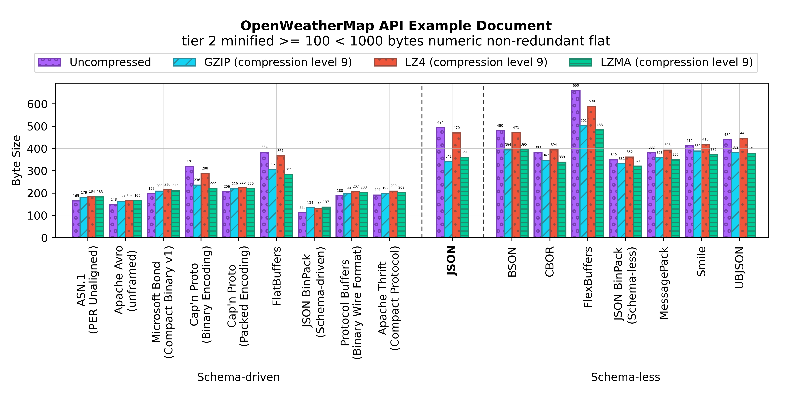

Binary JSON-compatible Format Benchmark
=======================================

A size benchmark of JSON-compatible binary serialization formats.

Results
-------

### ESLint configuration document

- [**Input Document**](benchmark/eslintrc/document.json)
- [**Benchmark Numbers**](output/eslintrc/data.dat)
### GeoJSON example JSON document

- [**Input Document**](benchmark/geojson/document.json)
- [**Benchmark Numbers**](output/geojson/data.dat)
### JSON Feed example document

- [**Input Document**](benchmark/jsonfeed/document.json)
- [**Benchmark Numbers**](output/jsonfeed/data.dat)
### OpenWeatherMap API example JSON document

- [**Input Document**](benchmark/openweathermap/document.json)
- [**Benchmark Numbers**](output/openweathermap/data.dat)
### NPM Package.json example manifest

- [**Input Document**](benchmark/packagejson/document.json)
- [**Benchmark Numbers**](output/packagejson/data.dat)
### NPM Package.json Linter configuration manifest

- [**Input Document**](benchmark/packagejsonlintrc/document.json)
- [**Benchmark Numbers**](output/packagejsonlintrc/data.dat)
