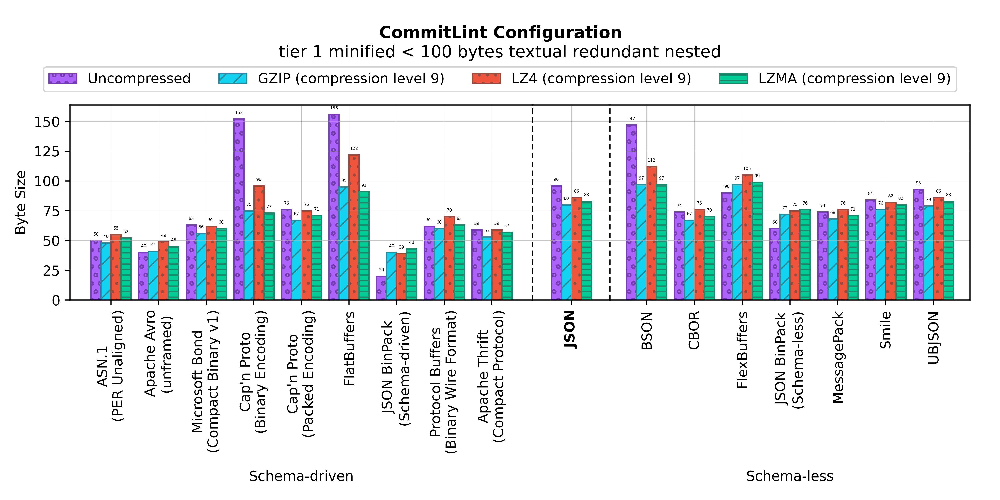
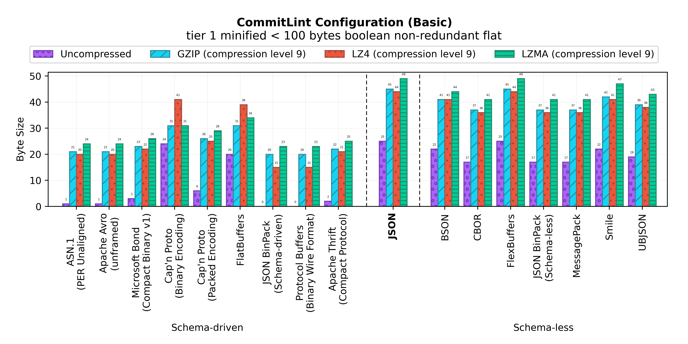
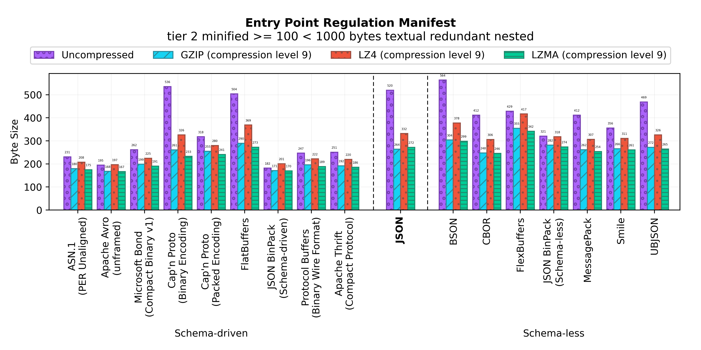
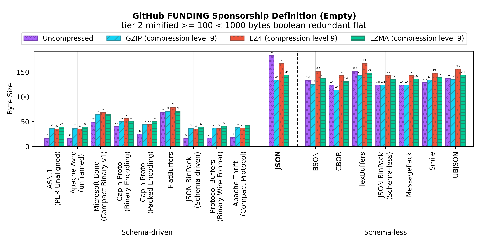
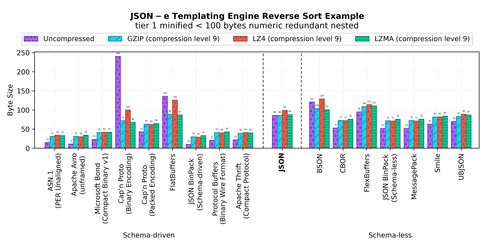
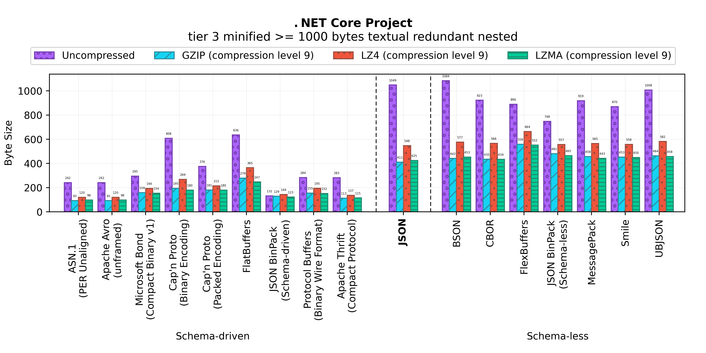
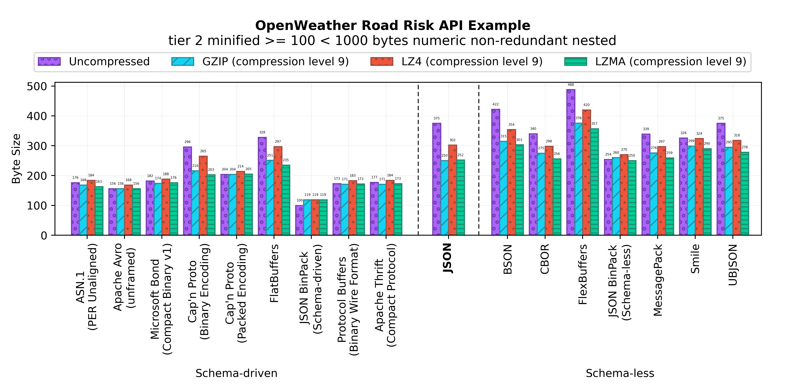
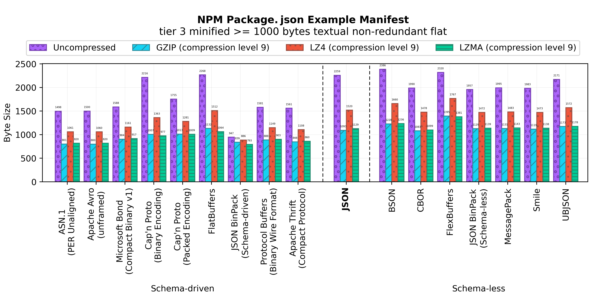
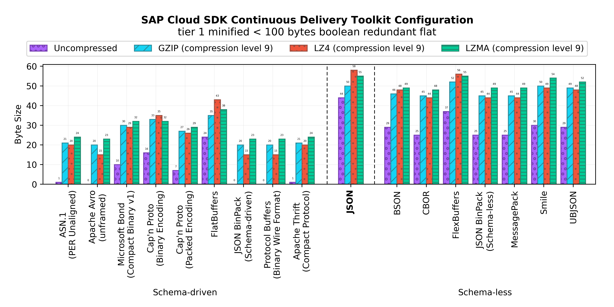
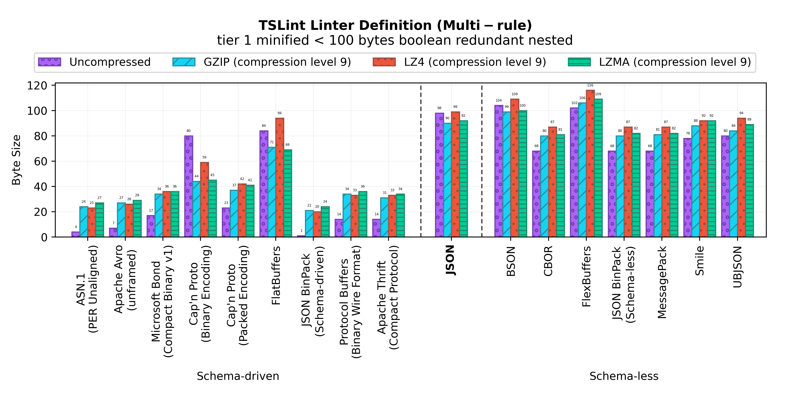

Binary JSON-compatible Format Benchmark
=======================================

A size benchmark of JSON-compatible binary serialization formats.

Serialization Formats
---------------------

This benchmark involves the serialization formats, implementations, and
encodings described in the table below.

| Serialization Format | Implementation           | Version | Encodings                       |
|----------------------|--------------------------|---------|---------------------------------|
| ASN.1                | ASN-1Step                | 10.0.2  | PER Unaligned                   |
| Apache Avro          | Python `avro` (pip)      | 1.10.0  | Binary Encoding with no framing |
| Microsoft Bond       | C++                      | 9.0.4   | Compact Binary v1               |
| BSON                 | Node.js `bson` (npm)     | 4.2.2   |                                 |
| Cap'n Proto          | `capnp`                  | 0.8.0   | Packed and Binary               |
| CBOR                 | Python `cbor2` (pip)     | 5.1.2   |                                 |
| FlatBuffers          | `flatc`                  | 1.12.0  | Binary Wire Format              |
| FlexBuffers          | `flatc`                  | 1.12.0  | Binary Wire Format              |
| MessagePack          | `msgpack-tools`          | 0.6     |                                 |
| Protocol Buffers     | Python `protobuf` (pip)  | 3.15.3  | Binary Wire Format              |
| Smile                | Clojure `cheshire`       | 5.10.0  |                                 |
| Apache Thrift        | Python `thrift` (pip)    | 0.13.0  | Compact Protocol                |
| UBJSON               | Python `py-ubjson` (pip) | 0.16.1  | Compact Protocol                |

Results
-------

### CircleCI definition (blank)


- [**Input Document**](benchmark/circleciblank/document.json)
- [**Benchmark Numbers**](output/circleciblank/data.dat)
  
### CircleCI matrix definition


- [**Input Document**](benchmark/circlecimatrix/document.json)
- [**Benchmark Numbers**](output/circlecimatrix/data.dat)
  
### CommitLint configuration



- [**Input Document**](benchmark/commitlint/document.json)
- [**Benchmark Numbers**](output/commitlint/data.dat)
  
### CommitLint configuration (basic)



- [**Input Document**](benchmark/commitlintbasic/document.json)
- [**Benchmark Numbers**](output/commitlintbasic/data.dat)
  
### Entry Point Regulation manifest



- [**Input Document**](benchmark/epr/document.json)
- [**Benchmark Numbers**](output/epr/data.dat)
  
### ESLint configuration document


- [**Input Document**](benchmark/eslintrc/document.json)
- [**Benchmark Numbers**](output/eslintrc/data.dat)
  
###  ECMAScript module loader definition


- [**Input Document**](benchmark/esmrc/document.json)
- [**Benchmark Numbers**](output/esmrc/data.dat)
  
### GeoJSON example JSON document


- [**Input Document**](benchmark/geojson/document.json)
- [**Benchmark Numbers**](output/geojson/data.dat)
  
### GeoJSON example JSON document with redundant coordinates


- [**Input Document**](benchmark/geojsonredundant/document.json)
- [**Benchmark Numbers**](output/geojsonredundant/data.dat)
  
### GitHub FUNDING sponsorship definition (empty)



- [**Input Document**](benchmark/githubfundingblank/document.json)
- [**Benchmark Numbers**](output/githubfundingblank/data.dat)
  
### GitHub Workflow Definition


- [**Input Document**](benchmark/githubworkflow/document.json)
- [**Benchmark Numbers**](output/githubworkflow/data.dat)
  
### Grunt.js "clean" task definition


- [**Input Document**](benchmark/gruntcontribclean/document.json)
- [**Benchmark Numbers**](output/gruntcontribclean/data.dat)
  
### ImageOptimizer Azure Webjob configuration


- [**Input Document**](benchmark/imageoptimizerwebjob/document.json)
- [**Benchmark Numbers**](output/imageoptimizerwebjob/data.dat)
  
### JSON-e templating engine reverse sort example



- [**Input Document**](benchmark/jsonereversesort/document.json)
- [**Benchmark Numbers**](output/jsonereversesort/data.dat)
  
### JSON-e templating engine sort example


- [**Input Document**](benchmark/jsonesort/document.json)
- [**Benchmark Numbers**](output/jsonesort/data.dat)
  
### JSON Feed example document


- [**Input Document**](benchmark/jsonfeed/document.json)
- [**Benchmark Numbers**](output/jsonfeed/data.dat)
  
### JSON Resume


- [**Input Document**](benchmark/jsonresume/document.json)
- [**Benchmark Numbers**](output/jsonresume/data.dat)
  
### .NET Core project.json



- [**Input Document**](benchmark/netcoreproject/document.json)
- [**Benchmark Numbers**](output/netcoreproject/data.dat)
  
### Nightwatch.js Test Framework Configuration


- [**Input Document**](benchmark/nightwatch/document.json)
- [**Benchmark Numbers**](output/nightwatch/data.dat)
  
### OpenWeatherMap API example JSON document


- [**Input Document**](benchmark/openweathermap/document.json)
- [**Benchmark Numbers**](output/openweathermap/data.dat)
  
### OpenWeather Road Risk API example



- [**Input Document**](benchmark/openweatherroadrisk/document.json)
- [**Benchmark Numbers**](output/openweatherroadrisk/data.dat)
  
### NPM Package.json example manifest



- [**Input Document**](benchmark/packagejson/document.json)
- [**Benchmark Numbers**](output/packagejson/data.dat)
  
### NPM Package.json Linter configuration manifest


- [**Input Document**](benchmark/packagejsonlintrc/document.json)
- [**Benchmark Numbers**](output/packagejsonlintrc/data.dat)
  
### SAP Cloud SDK Continuous Delivery Toolkit configuration



- [**Input Document**](benchmark/sapcloudsdkpipeline/document.json)
- [**Benchmark Numbers**](output/sapcloudsdkpipeline/data.dat)
  
### TravisCI notifications configuration


- [**Input Document**](benchmark/travisnotifications/document.json)
- [**Benchmark Numbers**](output/travisnotifications/data.dat)
  
### TSLint linter definition (basic)


- [**Input Document**](benchmark/tslintbasic/document.json)
- [**Benchmark Numbers**](output/tslintbasic/data.dat)
  
### TSLint linter definition (extends only)


- [**Input Document**](benchmark/tslintextend/document.json)
- [**Benchmark Numbers**](output/tslintextend/data.dat)
  
### TSLint linter definition (multi-rule)



- [**Input Document**](benchmark/tslintmulti/document.json)
- [**Benchmark Numbers**](output/tslintmulti/data.dat)
  

Running locally
---------------

The benchmark has only been ran on macOS and GNU/Linux. The following
dependencies must be available in order to locally run the benchmark:

- GNU Plot
- GNU Make
- CMake
- Clojure's `clj` command line tool
- Python 3 and `pip`
- Node.js and `npm`
- `clang`
- `gzip`
- XZ Utils
- `xxd`
- `jq`

Build the project dependencies by running the following command:

```sh
make deps
```

The benchmark can then be ran locally using the following command:

```sh
make all
```

Running the benchmark including the ASN.1 serialization formats requires
setting the `ASN1STEP` variable to the path to a license-activated `asn1step`
instance. For example:

```sh
make all ASN1STEP=/Applications/asn1step/asn1step/macosx-x86-64.trial/10.0.2/bin/asn1step
```
