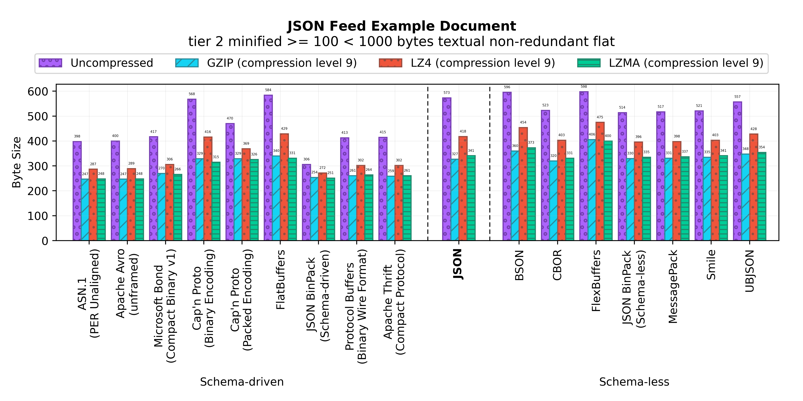

Binary JSON-compatible Format Benchmark
=======================================

A size benchmark of JSON-compatible binary serialization formats.

Results
-------

### ESLint configuration document

### GeoJSON example JSON document

### JSON Feed example document

### OpenWeatherMap API example JSON document

### NPM Package.json example manifest

### NPM Package.json Linter configuration manifest

- [**Input Document**](benchmark/packagejsonlintrc/document.json)
- [**Benchmark Numbers**](results/packagejsonlintrc/data.dat)
