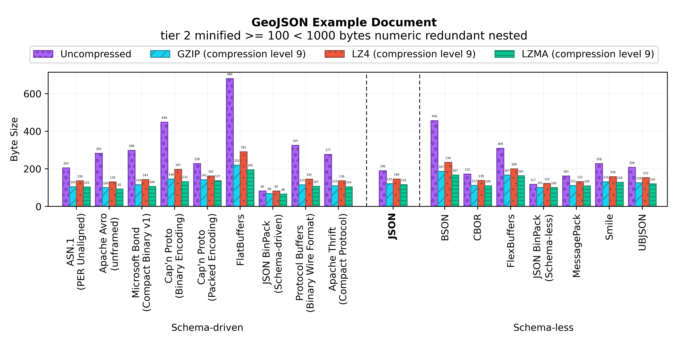

Binary JSON-compatible Format Benchmark
=======================================

A size benchmark of JSON-compatible binary serialization formats.

Results
-------

### CircleCI definition (blank)

- [**Input Document**](benchmark/circleci-blank/document.json)
- [**Benchmark Numbers**](output/circleci-blank/data.dat)
  
### CircleCI matrix definition

- [**Input Document**](benchmark/circleci-matrix/document.json)
- [**Benchmark Numbers**](output/circleci-matrix/data.dat)
  
### CommitLint configuration

- [**Input Document**](benchmark/commitlint/document.json)
- [**Benchmark Numbers**](output/commitlint/data.dat)
  
### CommitLint configuration (basic)

- [**Input Document**](benchmark/commitlint-basic/document.json)
- [**Benchmark Numbers**](output/commitlint-basic/data.dat)
  
### Entry Point Regulation manifest

- [**Input Document**](benchmark/epr/document.json)
- [**Benchmark Numbers**](output/epr/data.dat)
  
### ESLint configuration document

- [**Input Document**](benchmark/eslintrc/document.json)
- [**Benchmark Numbers**](output/eslintrc/data.dat)
  
###  ECMAScript module loader definition

- [**Input Document**](benchmark/esmrc/document.json)
- [**Benchmark Numbers**](output/esmrc/data.dat)
  
### GeoJSON example JSON document

- [**Input Document**](benchmark/geojson/document.json)
- [**Benchmark Numbers**](output/geojson/data.dat)
  
### GeoJSON example JSON document with redundant coordinates

- [**Input Document**](benchmark/geojson-redundant/document.json)
- [**Benchmark Numbers**](output/geojson-redundant/data.dat)
  
### GitHub FUNDING sponsorship definition (empty)

- [**Input Document**](benchmark/github-funding-blank/document.json)
- [**Benchmark Numbers**](output/github-funding-blank/data.dat)
  
### GitHub Workflow Definition

- [**Input Document**](benchmark/github-workflow/document.json)
- [**Benchmark Numbers**](output/github-workflow/data.dat)
  
### Grunt.js "clean" task definition

- [**Input Document**](benchmark/grunt-contrib-clean/document.json)
- [**Benchmark Numbers**](output/grunt-contrib-clean/data.dat)
  
### ImageOptimizer Azure Webjob configuration

- [**Input Document**](benchmark/imageoptimizer-webjob/document.json)
- [**Benchmark Numbers**](output/imageoptimizer-webjob/data.dat)
  
### JSON-e templating engine reverse sort example

- [**Input Document**](benchmark/jsone-reverse-sort/document.json)
- [**Benchmark Numbers**](output/jsone-reverse-sort/data.dat)
  
### JSON-e templating engine sort example

- [**Input Document**](benchmark/jsone-sort/document.json)
- [**Benchmark Numbers**](output/jsone-sort/data.dat)
  
### JSON Feed example document

- [**Input Document**](benchmark/jsonfeed/document.json)
- [**Benchmark Numbers**](output/jsonfeed/data.dat)
  
### JSON Resume

- [**Input Document**](benchmark/jsonresume/document.json)
- [**Benchmark Numbers**](output/jsonresume/data.dat)
  
### Netlify CMS Configuration

- [**Input Document**](benchmark/netlify-cms/document.json)
- [**Benchmark Numbers**](output/netlify-cms/data.dat)
  
### Nightwatch.js Test Framework Configuration

- [**Input Document**](benchmark/nightwatch/document.json)
- [**Benchmark Numbers**](output/nightwatch/data.dat)
  
### OpenWeather Road Risk API example

- [**Input Document**](benchmark/openweather-roadrisk/document.json)
- [**Benchmark Numbers**](output/openweather-roadrisk/data.dat)
  
### OpenWeatherMap API example JSON document

- [**Input Document**](benchmark/openweathermap/document.json)
- [**Benchmark Numbers**](output/openweathermap/data.dat)
  
### NPM Package.json example manifest

- [**Input Document**](benchmark/packagejson/document.json)
- [**Benchmark Numbers**](output/packagejson/data.dat)
  
### NPM Package.json Linter configuration manifest

- [**Input Document**](benchmark/packagejsonlintrc/document.json)
- [**Benchmark Numbers**](output/packagejsonlintrc/data.dat)
  
### SAP Cloud SDK Continuous Delivery Toolkit configuration

- [**Input Document**](benchmark/sap-cloud-sdk-pipeline/document.json)
- [**Benchmark Numbers**](output/sap-cloud-sdk-pipeline/data.dat)
  
### TravisCI notifications configuration

- [**Input Document**](benchmark/travis-notifications/document.json)
- [**Benchmark Numbers**](output/travis-notifications/data.dat)
  
### TSLint linter definition (basic)

- [**Input Document**](benchmark/tslint-basic/document.json)
- [**Benchmark Numbers**](output/tslint-basic/data.dat)
  
### TSLint linter definition (extends only)

- [**Input Document**](benchmark/tslint-extend/document.json)
- [**Benchmark Numbers**](output/tslint-extend/data.dat)
  
### TSLint linter definition (multi-rule)

- [**Input Document**](benchmark/tslint-multi/document.json)
- [**Benchmark Numbers**](output/tslint-multi/data.dat)
  
